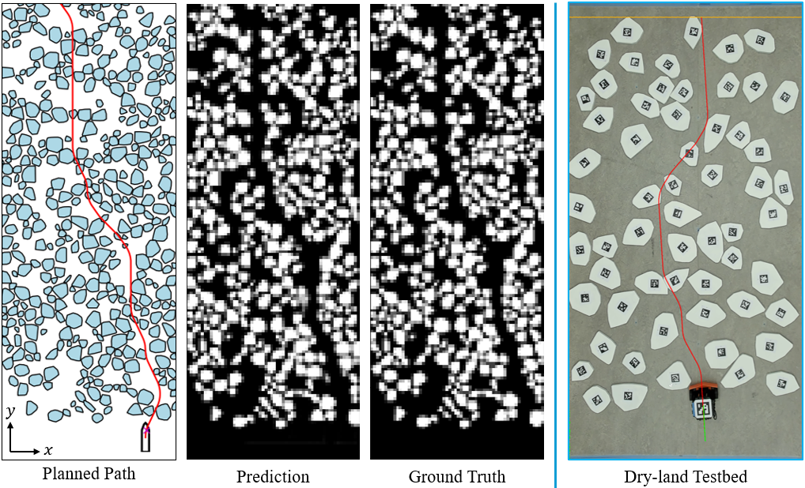

# Autonomous Navigation in Ice-Covered Waters with Learned Predictions on Ship-Ice Interactions
Code for our work [paper](https://arxiv.org/abs/2302.11601) "Autonomous Navigation in Ice-Covered Waters with Learned Predictions on Ship-Ice Interactions".





## Installation

This project requires [ROS Humble](https://docs.ros.org/en/humble/Installation.html) and has been testbed on Ubuntu 22.04. with Python 3.10. While not required, CUDA (Nvidia GPU) is highly recommended for our predictive planner.

1. Clone the project
```bash
git clone https://github.com/IvanIZ/predictive-asv-planner.git
```

2. install dependencies. Note, may need to install the
[dubins](https://github.com/AndrewWalker/pydubins) package manually
(see [here](https://github.com/AndrewWalker/pydubins/issues/16#issuecomment-1138899416) for instructions).
```bash
pip install -r requirements.txt
```

## Usage

### Download the ice field environments
You may download the ice environments from [here](https://drive.google.com/file/d/1pVcaqDrTADsRagiR_6-3vZyh9Bg_5lsX/view?usp=sharing) (350MB). By defult the file should be under home/user/Downloads. Unzip the file
```bash
cd ~/Downloads
unzip ~/Downloads/ice_environments.zip
```

Then move the extracted environments to the repository
```bash
mv ~/Downloads/ice_environments ~/predictive-asv-planner/
```

### Run ship navigations
The simulation runs with two ROS nodes - a navigation node and planner node.

Run the following command to start the navigation node, which loads the environments and runs the physics simulations
```bash
python asv_navigation.py
```

In a new terminal, run one of the following commands to start a specific planner. To run our predictive planner:
```bash
python planners/predictive.py
```

To run the lattice planner
```bash
python planners/lattice.py
```

To run the skeleton planner
```bash
python planners/skeleton.py
```

To run the straight-line planner
```bash
python planners/straight.py
```

#### Configuration File
All parameters are set in the config.yaml file in the `config` directory. 

#### Experiment Logs
After each trial, the navigation visualization and collision statistics can be found in the ```logs``` directory. 